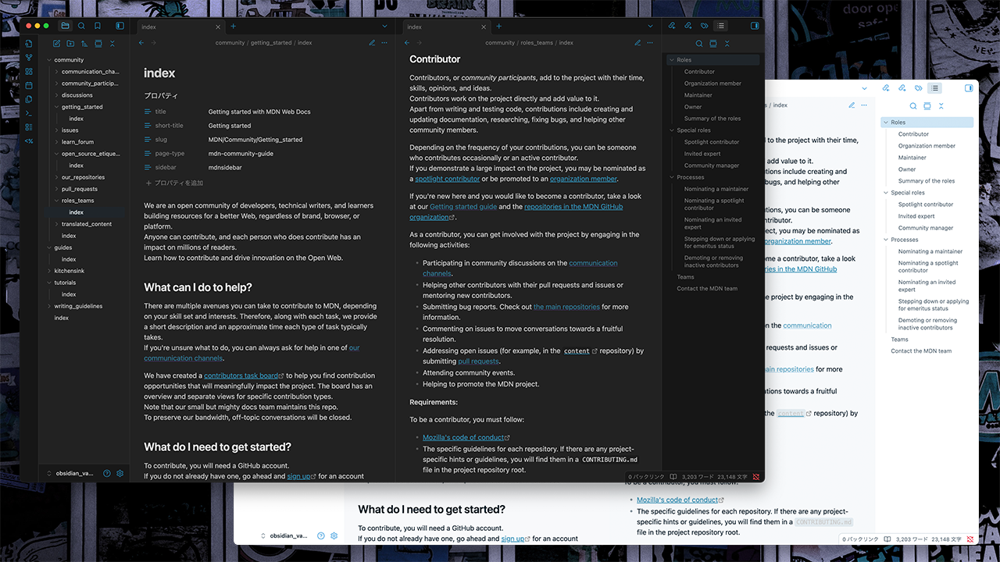
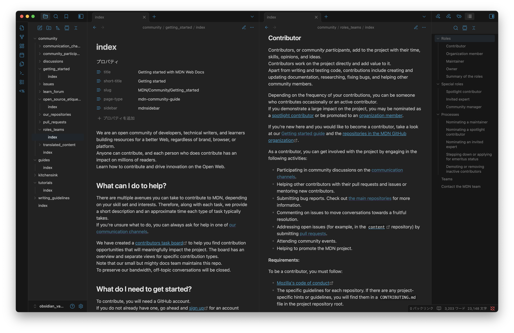
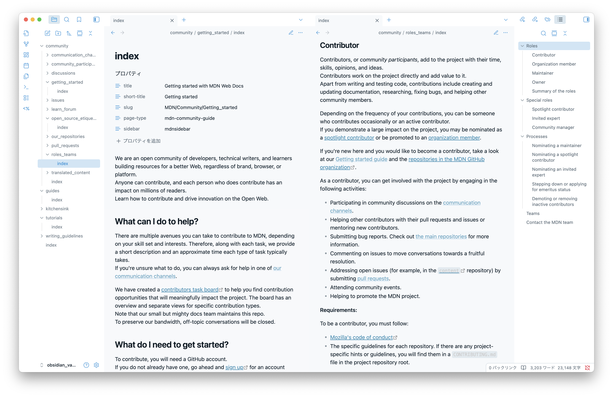

# Neo Sploosh for Obsidian

**Neo Sploosh** is a light theme that combines cool blues, soft grays, and bright yellow accents for a clean, quick-feeling look. The name comes from the [_Neo Sploosh-o-matic_](https://splatoonwiki.org/wiki/Neo_Sploosh-o-matic), the Splatoon 3 weapon that inspired the palette.

## Installation

1. Download the latest `theme.css` and `manifest.json`.
2. Place them inside `.obsidian/themes/Neo Sploosh`.
3. In Obsidian, open *Settings → Appearance → Themes* and select **Neo Sploosh**.

## License

Released under the MIT license.

